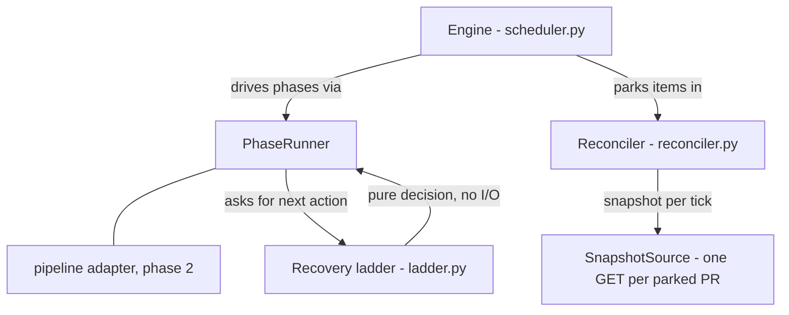

<!-- SPDX-License-Identifier: Apache-2.0 -->
<!-- SPDX-FileCopyrightText: 2026 The Linux Foundation -->

# Merge Orchestration Engine — Design

Package: `src/dependamerge/engine/`

Status: **Phase 1 — engine landed standalone (this document's PR).**
Nothing in the production merge path uses it yet; wiring happens in a
follow-up PR (see [Migration plan](#migration-plan)).

## Motivation

The current orchestration (`merge_prs_parallel` → `_merge_single_pr`)
grew a series of inline waiting loops, each added for a specific
scenario. Three structural problems fell out of that growth, all
observed in production bulk-merge runs:

### 1. Waiting pins concurrency slots

Every waiting loop (`_wait_for_auto_merge`, the conflict-recovery
poll, the post-rebase REST poll, the recreate poll, the
recreated-checks wait, the pre-commit.ci re-trigger wait) runs inside
the worker task that holds one of the N global concurrency slots. A PR
that needs a `@dependabot rebase` occupies a slot for the full wait
(rebase turnaround is routinely 3–5 minutes; CI adds more).

Worked example from a real run: 41 repositories all needed a rebase to
re-run a required org check. With 10 slots and a five-minute wait
each, the batch drains in ceil(41/10) × ~5 min ≈ **20–25 minutes of
idle waiting**, while runnable PRs in other repositories queue
behind parked ones. With parking (waiting holds no slot), the same
batch issues all 41 rebases in one scheduling pass and total
wall time collapses to ~one rebase+CI latency.

### 2. Budgets are per-loop, not per-run

A single loop — `_wait_for_auto_merge` — honours `--max-wait` (the run
deadline) and `--no-wait`. The pre-commit.ci poll, the recreate poll,
the recreated-checks wait, and the post-rebase poll each
independently burn up to `--merge-timeout` (default 300 s) — a single
unlucky PR can stack ~5 of these sequentially. So the run deadline
does not bound the run.

### 3. Scattered, incomplete recovery routing

Recovery decisions live in four places (`_merge_single_pr` Steps
0.5/5/5.5/6, `_handle_merge_conflict`, `_report_merge_failure`, the
rebase module), each with its own entry conditions. Gaps fall through
the cracks; the motivating incident: an org-required workflow-audit
check failed against **stale branch content** (the base branch
already carried the fix). The legacy code classified "completed failing
required check" as terminal and reported failure for 88 of 92 PRs —
when a rebase would have re-run the check against current base and
allowed every one of them to merge.

Related accounting bugs (fixed by construction here): two failure
paths return a `MergeResult` without ever calling the progress
tracker, so the ticker over-counts in-flight PRs; and
`_merge_pr_with_retry` sleeps while holding the per-repo dispatch
lock.

## Architecture

Three small, independently testable pieces:

### Work items and phases (`model.py`)

Each PR becomes a `WorkItem` (opaque `payload`, stable `key`,
caller-order `index`, per-repo `lane`). A `PhaseRunner` executes named
phases; each phase does bounded active work and returns a transition:

- `Advance(phase)` — run another phase next, without waiting.
- `Park(reason, wake, on_wake, on_timeout, timeout)` — wait for an
  external event without holding a slot.
- `Finish(outcome)` — terminal.

The engine is generic: it imports no GitHub types and never inspects
payloads or outcomes. This keeps it free of import cycles and lets
stub pipelines exercise the whole scheduling kernel in tests.

### Scheduler (`scheduler.py`)

- **Lanes** — items sharing a lane run strictly sequentially, FIFO.
  Lane = repository, preserving the ≤1-in-flight-per-repo invariant
  (avoids mergeability-propagation races and dependabot rebase
  storms). `flat_lanes()` reproduces legacy flat-scheduler semantics
  when other code handles per-repo serialisation.
- **Slots** — a global semaphore bounds *active* phases and nothing
  else. A parked
  item holds no slot, so waiting never starves runnable work. (API
  protection is not the semaphore's job: the shared `GitHubAsync`
  client has its own concurrency cap, RPS limiter and adaptive
  throttle.)
- **Parking** — the engine clamps every park deadline to the run
  deadline (`max_wait`), uniformly — fixing the per-loop budget
  problem. `max_wait == 0` is fire-and-forget: the parking phase's
  side effects (rebase requested, auto-merge armed) still happen, then
  `on_timeout` runs straight away.
- **Failure model** — a phase exception becomes a terminal outcome via
  `PhaseRunner.on_error` (never raises); the lane continues with its
  next item. `MAX_PHASE_EXECUTIONS` (100) converts a transition-cycle
  bug into a per-item failure instead of a hang.
- **Finalization** — `on_item_done` fires once per item, the
  single place to update the progress tracker. This closes the
  "result returned but tracker never told" class of bug.

### Reconciler (`reconciler.py`)

One background coroutine watches **all** parked items. Each tick
(fixed interval) it refreshes one `Snapshot` per parked item — batched
through the shared HTTP client — evaluates each item's wake predicate,
and resolves the item's future: `True` (condition fired → `on_wake`)
or `False` (deadline passed → `on_timeout`).

API cost matches the status quo (one GET per waiting PR per
poll interval); what changes is that waiting consumes zero
concurrency. A failed or partial refresh (`None`/exception) keeps the
previous snapshot and never wakes or expires an item by itself.

This is also what makes the engine correct when **auto-merge is
unavailable** (org/repo setting): the engine parks on "PR became
clean" and performs the merge itself on wake, rather than depending on
GitHub's auto-merge to fire. Fire-and-forget (`max_wait 0`) with
auto-merge unavailable still reports the PR as blocked, matching
legacy behaviour.

### Recovery ladder (`ladder.py`)

All "not mergeable yet" routing is a single pure decision table:
`decide(LadderInput) -> Action`. No I/O — every rung is unit-testable.
Rungs in priority order:

1. `dirty` (conflict) — dependabot: `@dependabot rebase`; anyone
   else: terminal `merge conflicts`.
2. `behind` — rebase (macro / update-branch), else arm auto-merge.
3. `blocked` + **failing required check** + **behind base** —
   **rebase**. The verdict is stale; a rebase alone re-runs the check
   against current base.
4. `blocked` + stuck required check — dependabot: recreate; stale
   pre-commit.ci: re-trigger. Stuck outranks the pending-wait rung:
   waiting on a check that will never report cannot succeed.
5. `blocked` + pending required checks — arm auto-merge, park until
   they land.
6. `blocked`, no recovery applies — terminal, with
   `analyze_block_reason`'s phrase.
7. `unstable` — merge while the merge button is live (`mergeable` is
   True, e.g. a red non-required check); otherwise wait once
   for mergeability to settle, then fail.
8. `clean` / unknown — attempt the merge.

Rung 3 is the rung the legacy code lacks (the 88-PR incident). Guards:
the rung requires proof of `behind_by > 0` (`None` fails closed to
rung 6), and every recovery rung fires **at most once per item per
run** (`attempted` markers), so a recovery that doesn't change the
observed state degrades to the next rung instead of looping. The rung
defaults to on —
no new CLI flag — consistent with the tool's hands-off philosophy.

## Behavioural contracts preserved

The existing test suite asserts the following legacy contracts, and
the engine preserves them (Phase 1 proves them against stub
pipelines; Phase 2 re-asserts them end-to-end):

- Results return in input order.
- ≤1 in-flight PR per repository, FIFO within the repo.
- A phase exception fails that item with its message; sibling items
  keep running.
- `AUTO_MERGE_PENDING` outcomes get `pr_completed()`, and no other
  tracker call (no
  started/failed double-count).
- Exact user-facing strings: `merge conflicts`,
  `stuck check: <name>`, `already merged externally`,
  `auto-merge unavailable`, `🔀 Merge conflict` (no duplicate
  `❌ Failed`).
- Approval happens strictly after a conflict clears, never before.
- `update_branch` is never called on the local-rebase path.
- CLI seam `cli._run_parallel_merge(ctx, prs, preview=...)` returns
  `list[MergeResult]` unchanged.

## Migration plan

### Phase 1 (this PR)

Engine package + tests. Standalone: no production code path imports
it, no behaviour change, full legacy suite must pass untouched.

### Phase 2 (follow-up PR)

1. **Pipeline adapter** implementing `PhaseRunner` with phases mapping
   the legacy steps: `intake` (github2gerrit detection, merge-method
   resolution) → `assess` (mergeability refresh,
   `_check_merge_requirements`) → `recover` (build `LadderInput` from
   `analyze_block_reason` + `compare.behind_by` +
   `_detect_stuck_required_check` + check-run classification; execute
   the ladder's action; park) → `dispatch` (approve +
   `_merge_pr_with_retry`, sleeping *outside* any lane lock) →
   `complete`.
2. The adapter reuses leaf operations as-is, calling them **through
   the manager
   instance** (`_approve_pr`, `_merge_pr_with_retry`,
   `_detect_github2gerrit`, `_get_merge_method_for_repo`,
   `_trigger_stale_precommit_ci`, `_check_merge_requirements`), so the
   existing patch-bundle test seam survives.
3. Wire `merge_prs_parallel`: striped scheduler → lane = repo; flat
   scheduler → `flat_lanes()`.
4. Move all tracker accounting into `on_item_done`.
5. Rework the ~96 orchestration-level test functions (of ~600) that
   assert on the old loop internals, preserving their behavioural
   assertions through the same patch seam.

### Phase 3 (optional cleanup)

Delete the superseded waiting loops and the per-loop timeout
parameters they carried; collapse `_handle_merge_conflict` /
`_report_merge_failure` routing into the ladder.

## Testing

`tests/engine/` covers the three pieces in isolation with stub
pipelines and snapshot sources (no GitHub mocks needed):

- **Ladder** — table-driven: every rung, every guard (`behind_by`
  `None`/0/positive, attempt markers, dependabot vs human), priority
  between overlapping conditions.
- **Scheduler** — ordering, lane FIFO/isolation, slot release while
  parked (parked > concurrency items make progress), run-deadline
  clamping, no-wait mode, exception conversion, phase-budget guard,
  `on_item_done` (including observer exceptions), `flat_lanes`.
- **Reconciler** — wake on predicate, timeout on deadline, failed
  refresh keeps waiting, predicate exception tolerated, `flush`,
  `parked_view`.

Timing style matches repo conventions: real short sleeps with short
timeouts (`asyncio_mode = "auto"`), no fake clocks.
